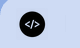

# Ejercicios de HTML

### Ejercicio 1: Crea un archivo `blog.html` y coloca el siguiente contenido con las etiquetas que conocemos hasta el momento:
  - Un título principal centrado sobre el tema del blog
  - Un párrafo descriptivo de la temática del blog
  - Otro título de la sección de artículos
    - En esta sección, es decir, debajo del título de los "Posts" colocamos al menos una futura entrada:
      - Título, por ejemplo "Mi primer post"
      - Una imagen del post
      - Una pequeña explicación de lo que va el post (máximo 2-3 líneas)

```
  Mi blog sobre Programación

  En este blog, vamos a aprender cómo funciona la programación de sistemas informáticos.

  Posts

  Mi Primer Post
  
  Descripción

```

### Ejercicio 2: Crea un `post.html` para hacer una página de artículo de este blog con estos elementos:
  - Título principal
  - Imagen del post
  - Párrafo introductorio
  - Títulos de las secciones del post (de 3 a 5).

```
    Aprender HTML

    
    
En este post vamos a aprender qué es HTML y las principales etiquetas del lenguaje.

    Qué es HTML

    Cómo se crea un archivo HTML

    Etc.

```

**Nota:** Añadimos ejemplo de cómo se puede navegar con `<a>` entre unos pocos archivos.

Claro, aquí te presento tres enunciados de ejercicios que se centran en temas adicionales como el uso de colores CSS, estilización de enlaces y la implementación de un favicon:

### Ejercicio 3: Estilización de Enlaces CSS

**Nota:** podeis aprovechar lo hecho en los ejercicios 1 y 2 o empezar otros archivos.

Crea o edita un archivo HTML llamado `index.html` o `blog.html` que contenga una página principal con al menos tres secciones:

- Una sección de **encabezado** con un título principal centrado.
- Una **sección** de contenido con tres párrafos sobre un tema de interés.
- Una sección de enlaces, donde cada enlace (`<a>`) lleve a una página diferente, es decir, una **barra de navegación**.

Estiliza los enlaces (`<a>`) utilizando CSS para que:
- Cambien de color (`#007bff`) al pasar el mouse sobre ellos (hover). Se puede adaptar el color según diseño pero debe estar el efecto.
- Tengan un fondo (`background-color`) ligero cuando estén en estado activo -> `:active`.

Estructura recomendada por W3schools:


Falta alguna etiqueta como `details` o `summary`.

**Bonus:** Coloca navegación entre las secciones con enlaces.

### Ejercicio 4: Implementación de Favicon

Añade un favicon a tu página principal `index.html` de tu sitio web:
- Descarga un archivo de icono (`favicon.ico`) o utiliza una imagen de tamaño adecuado.
- Agrega el favicon al documento HTML utilizando la etiqueta `<link>` dentro del `<head>`.

```html
<link rel="icon" href="favicon.ico" type="image/x-icon">
```

Verifica que el favicon se muestra correctamente en la pestaña del navegador al cargar la página. Ejemplo:



### Ejercicio 5: Uso de Colores CSS

Crea un archivo `styles.css` en el mismo directorio que tus archivos HTML del blog para agregar estilos CSS específicos a tus elementos.

En tu archivo HTML principal (`blog.html`), enlaza tu archivo de estilos CSS utilizando la etiqueta <link> en la sección <head>. Luego, dentro de este archivo CSS, aplica estilos a las secciones de entradas de blog (`post-preview`) para resaltarlas con diferentes colores de fondo y estilos de texto.

**Nota:** la idea es colocar los estilos _desde_ la hoja externa.

Asegúrate de que cada entrada de blog (`<div class="post-preview">`) tenga un color de fondo único y apliques estilos adecuados a los enlaces (`<a>`) dentro de cada entrada para mejorar la legibilidad y la interactividad del usuario al navegar por tu blog.


### Ejercicio 6: Mas estilos con CSS

Añade algunos de estos usos de CSS o etiquetas en la página donde sea coherente con el diseño:

- Estilo de botón a un enlace (`a`)
- Enlace relativo a otro achivo (p.e: `img`)
- Imagen como enlace (`a` y `img`)
- En la sección de contacto o similar, `<a>` para enviar email o llamar

### Ejercicio 7: Diseño Responsive con Media Queries

**Nota:** te puedes basar en la estructura presentada en [layout.html](layout.html) para el responsive.

Ejemplo de media query con breakpoint desde 500px de ancho o inferior:
```css
@media(max-width:500px;){
  h1 { ... }
}
```

Agrega media queries en tu archivo `styles.css` para hacer que la página blog.html sea responsive. Debes asegurarte de que el contenido se visualice correctamente en dispositivos de diferentes tamaños:

Configura un breakpoint para pantallas menores de `768px`, donde las columnas de contenido se apilen en lugar de estar lado a lado.
Asegúrate de que el texto sea legible y las imágenes se escalen adecuadamente en dispositivos móviles.

### Ejercicio 8: Menú de Navegación Responsive

Implementa un *menú de navegación* que sea responsive y se adapte a dispositivos móviles en blog.html:

El menú debería mostrarse como una barra horizontal en pantallas grandes.
En pantallas más pequeñas, el menú debería transformarse en un menú hamburguesa que los usuarios puedan expandir y colapsar.

**Nota:** se puede hacer con `flex` o con media queries.

PC:
```
link 1    link 2    link 3
```

móvil:
```
link 1
link 2
link 3
```

### Ejercicio 9: Imágenes Flexibles
Modifica las imágenes de tus posts en `blog.html` para que sean flexibles y responsivas:

Utiliza propiedades CSS como max-width y height auto para asegurar que las imágenes se ajusten al ancho de la pantalla sin distorsionarse.
Asegúrate de que las imágenes no excedan el ancho de la pantalla en dispositivos móviles.

**Nota:** se puede hacer con media queries.

### Ejercicio 10: Columnas Flexibles para Artículos
En `blog.html`, utiliza Flexbox para organizar los artículos en columnas que se adapten al tamaño de la pantalla:

En pantallas de escritorio, los artículos deben mostrarse en dos o tres columnas.

En dispositivos móviles, los artículos deben mostrarse en una sola columna para facilitar la lectura.

Juego que explica como funciona flex:
- Rana flex: https://flexboxfroggy.com/#es
- Flexbox en W3Schools: https://www.w3schools.com/css/css3_flexbox.asp

Ejemplo:
```css
  #container {
    display: flex;
    justify-content: space-around;
    flex-wrap: wrap; /* coloca los elementos en col si no hay expacio en fila */
    border:1px solid black;
    padding: 10px;
  }
  #container div {
    width: 100px;
    height: 50px;
    margin: 10px;
    background-color: aliceblue;
    border: 3px dashed blue;
  }
  p {
    text-align: center;
  }
```
```html
  <div id="container">
    <div><p>1</p></div>
    <div><p>2</p></div>
    <div><p>3</p></div>
  </div>  
```

Ejemplo de como quedan estos divs con flex en [flex.html](flex.html).